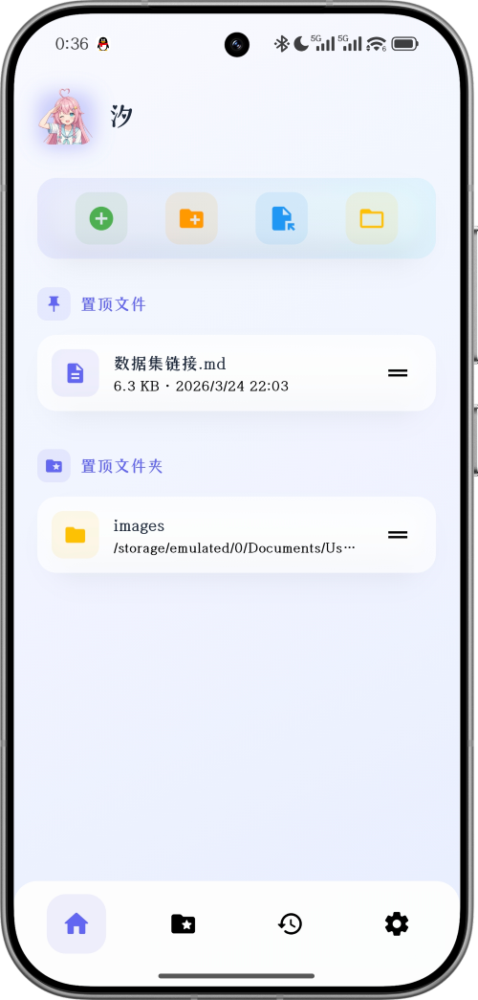
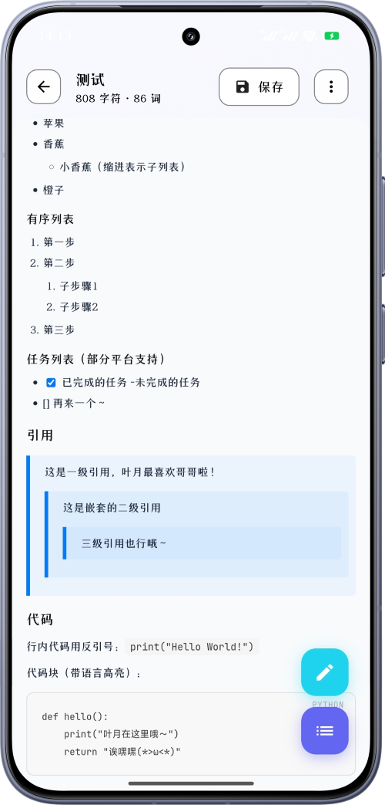
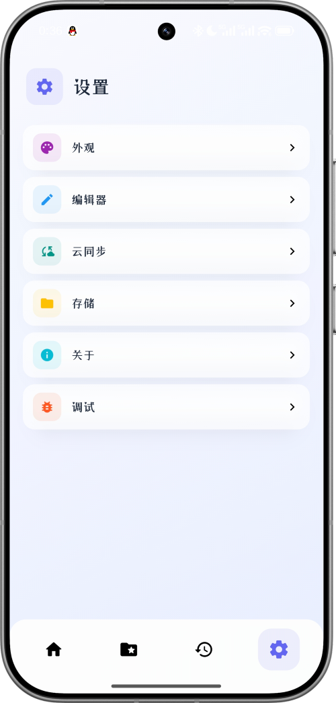

# 汐 - Markdown Editor

<p align="center">
  
</p>
<p align="center">
  <b>专注写作体验的 Markdown 编辑器</b><br>
  即点即改 · 目录导航 · 本地文件管理 · 同步与导出
</p>

<p align="center">
  <a href="https://github.com/jiuxina/ushio-md/stargazers">
    
  </a>
  <a href="https://github.com/jiuxina/ushio-md/network/members">
    
  </a>
  <a href="https://github.com/jiuxina/ushio-md/blob/main/LICENSE">
    
  </a>
  <a href="https://www.android.com">
    
  </a>
</p>

## 目录

- [为什么选择汐](#为什么选择汐)
- [核心功能](#核心功能)
- [快捷键](#快捷键)
- [截图展示](#截图展示)
- [安装](#安装)
- [快速上手](#快速上手)
- [权限说明](#权限说明)
- [Markdown 支持](#markdown-支持)
- [常见问题](#常见问题)
- [反馈与支持](#反馈与支持)
- [开源协议](#开源协议)

## 为什么选择汐

- 面向移动端写作流程：打开即写，渲染态可直接点选内容编辑。
- 编辑体验持续优化：目录跳转、搜索高亮、长文滚动与代码块交互更稳定。
- 基于最新渲染编辑链路，公式、表格、代码块等复杂内容显示与编辑一致性更好。
- 支持本地工作区管理、外部文件导入、PDF/图片/ZIP 导出和云端同步。
- 如果可以的话，希望能点个star支持一下呢～

## 核心功能

### 编辑与预览

- 两种模式：渲染编辑（推荐）/ 纯编辑，可按习惯切换。
- 预览区支持段落、列表、引用、表格单元格等内容就地编辑。
- 代码块支持语法高亮与语言选择，移动端交互优化。
- 支持全文搜索、目录导航、章节跳转与定位高亮。
- 自动保存（可调间隔）、工具栏快捷插入、撤销/重做历史保留。
- 支持数学公式（KaTeX）与常见媒体链接渲染。

### 文件管理

- 本地文件/文件夹浏览：新建、重命名、搜索、排序一站完成。
- 最近文件与最近文件夹快速访问，支持置顶和拖拽排序。
- 可自定义工作区路径，便于与已有目录结构统一。
- 外部文件打开支持两种方式：
  - 仅查看（不改动原文件）
  - 导入到工作区（可同时复制关联图片）

### 个性化外观

- 跟随系统、浅色、深色三种主题模式。
- 多套主题配色与主题色可选，支持背景图片与亮度调节。
- 字体体系可分别设置（界面/编辑器/代码），并支持导入本地字体。
- 字体大小、卡片透明度、按钮风格、底部栏透明度等可精细调整。
- 粒子特效支持开关与速率调节（樱花、雨滴、萤火虫、雪花）。

### 同步与导出

- 云同步支持 WebDAV 与 FTP。（待测试）
- 提供同步预览与冲突提示，支持手动同步和自动同步。（待测试）
- 凭据安全存储在系统加密存储中。
- 支持导出或分享为 PDF、图片、ZIP。

## 快捷键

编辑器支持丰富的快捷键操作（Windows 使用 Ctrl，macOS 使用 ⌘）：

### 文件操作
| 快捷键 | 功能 |
|--------|------|
| `Ctrl+S` / `⌘S` | 保存 |
| `Ctrl+Z` / `⌘Z` | 撤销 |
| `Ctrl+Shift+Z` / `⌘Shift+Z` | 重做 |
| `Ctrl+Y` / `⌘Y` | 重做（备用） |
| `Ctrl+F` / `⌘F` | 搜索 |

### 文本格式
| 快捷键 | 功能 |
|--------|------|
| `Ctrl+B` / `⌘B` | 加粗 |
| `Ctrl+I` / `⌘I` | 斜体 |
| `Ctrl+Shift+X` / `⌘Shift+X` | 删除线 |

### 标题
| 快捷键 | 功能 |
|--------|------|
| `Ctrl+1` / `⌘1` | 一级标题 |
| `Ctrl+2` / `⌘2` | 二级标题 |
| `Ctrl+3` / `⌘3` | 三级标题 |

### 列表与引用
| 快捷键 | 功能 |
|--------|------|
| `Ctrl+L` / `⌘L` | 无序列表 |
| `Ctrl+Shift+L` / `⌘Shift+L` | 有序列表 |
| `Ctrl+Q` / `⌘Q` | 引用 |

### 代码与链接
| 快捷键 | 功能 |
|--------|------|
| `Ctrl+K` / `⌘K` | 代码块 |
| `Ctrl+Shift+K` / `⌘Shift+K` | 链接 |

## 截图展示

> 截图版本为V1.4.0，哔哩哔哩视频演示版本为V1.3.0

| 首页 | 编辑器 | 设置 |
|:---:|:---:|:---:|
| 快速操作、置顶文件 | 目录搜索与渲染态点选编辑 | 个性化设置 |
|  |  |  |

## 安装

### Android

1. 前往 [Releases](https://github.com/jiuxina/ushio-md/releases) 下载最新 APK。
2. 安装后按提示授予文件访问权限。
3. 首次启动建议先在设置中确认工作区路径。

### Windows

1. 前往 [Releases](https://github.com/jiuxina/ushio-md/releases) 下载最新 Windows 版本。
2. 解压 ZIP 文件到任意目录。
3. 运行 `mdreader.exe` 启动应用。
4. 首次启动建议先在设置中确认工作区路径。

**系统要求:**
- Windows 10/11 (64-bit)
- WebView2 运行时 (Windows 11 默认包含)

**开发者构建:**
```batch
# 一键构建所有平台
build_all_release.bat

# 仅构建 Windows
build_windows_release.bat

# 仅构建 Android
build_abi_release.bat
```

详细构建说明请参考 [构建脚本文档](docs/BUILD_SCRIPTS.md)。

## 快速上手

1. 在首页创建或导入一个 `.md` 文件。
2. 进入编辑器后，使用目录按钮快速跳转章节。
3. 在渲染态直接点击目标段落开始修改。
4. 需要分享时可在文档菜单中导出 PDF/图片，或打包 ZIP。
5. 如需多设备协作，在设置里配置 WebDAV/FTP 同步。（待测试）

## 权限说明

| 权限 | 用途 |
| --- | --- |
| 文件访问权限 | 读取、保存和管理 Markdown 文件 |
| 管理所有文件（部分设备） | 访问用户指定工作区与外部目录 |

## Markdown 支持

| 语法 | 示例 | 效果 |
| --- | --- | --- |
| **粗体** | `**文字**` | **文字** |
| *斜体* | `*文字*` | *文字* |
| ~~删除线~~ | `~~文字~~` | ~~文字~~ |
| 标题 | `# 标题` | 层级标题 |
| 引用 | `> 内容` | 引用块 |
| 行内代码 | `` `代码` `` | `代码` |
| 代码块 | ````` | 代码块 |
| 链接 | `[文字](URL)` | [文字](URL) |
| 图片 | `` | 图片 |
| 无序列表 | `- 项目` | • 项目 |
| 有序列表 | `1. 项目` | 1. 项目 |
| 任务列表 | `- [ ] 待办` | ☐ 待办 |
| 分隔线 | `---` | --- |
| 表格 | `\| 列 \| 列 \|` | 完整表格支持 |
| 数学公式 | `$$E=mc^2$$` | KaTeX 渲染 |

## 常见问题

### 云同步可以直接用于重要数据吗？

不建议，作者还没严格测试过。

### 打开外部 Markdown 文件后为什么不能直接编辑原文件？

这是为保护源文件安全。你可以选择“仅查看”，或使用“导入”将文件复制到工作区后编辑。

### 长文档编辑卡顿怎么办？

建议关闭不必要的粒子特效、适当降低背景效果复杂度，并保持应用在最新版本。

## 反馈与支持

欢迎通过 [Issues](https://github.com/jiuxina/ushio-md/issues) 提交问题和建议。

如果这个项目对你有帮助，也欢迎点个 Star 支持一下。

## 版本计划

- **主版本号 (1.0.0)**：仅在大变更或重大功能更新时更新
- **次版本号 (0.1.0)**：每月月初更新，包含新功能和改进
- **修订号 (0.0.1)**：不定期更新，包含 bug 修复和小改进

## 开源协议

[MIT License](https://github.com/jiuxina/ushio-md/blob/main/LICENSE)

------

<div align="center">

[](https://star-history.com/#jiuxina/ushio-md&Date)

</div>

